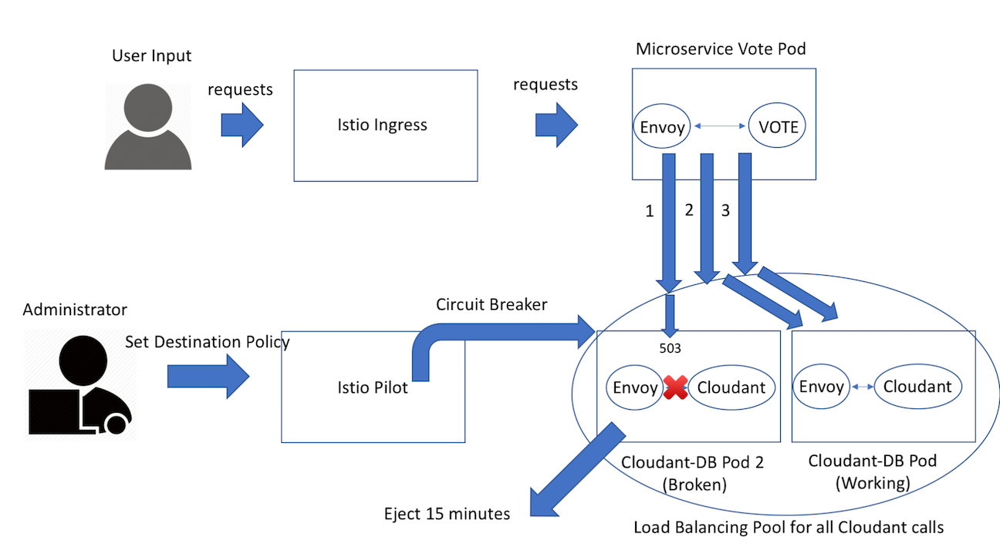

[](https://travis-ci.org/IBM/resilient-java-microservices-with-istio)

# Enable your Java microservices with advanced resiliency features leveraging Istio 

Building and packaging Java microservice is one part of the story. How do we make them resilient? How do we introduce health checks, timeouts, retries, ensure request buffering or reliable communication between microservices? Some of these features are coming built in microservices framework, but often they are language specific, or you have to accomodate for it in your application code. How do we introduce it without changing the application code? Service-mesh architecture attempts to solve these issues. [Istio](https://istio.io) provides an easy way to create this service mesh by deploying a [control plane](https://istio.io/docs/concepts/what-is-istio/overview.html#architecture) and injecting sidecars containers alongside your microservice. 

In this code we demonstrate how to build and deploy your Java [MicroProfile](http://microprofile.io) microservices leveraging Istio service mesh. MicroProfile is a baseline Java platform for a microservices architecture and delivers application portability across multiple MicroProfile runtimes - the initial baseline is JAX-RS plus CDI plus JSON-P. It provides specs for building and pakaging Java microservices in a standardized way. 

We then show how to configure and use circuit breakers, health checks and timeouts/retries resiliency features for the application.

**Resiliency and fault tolerance**: Istio adds fault tolerance to your application without any changes to code. Some of resiliency features it supports are: 

 - Retries/Timeouts
 - Circuit breakers
 - Health checks
 - Control connection pool size and request load
 - Systematic fault injection
 
We use the sample MicroProfile web application for managing a conference and it is based on a number of discrete microservices. The front end is written in Angular; the backing microservices are in Java. All run on WebSphere Liberty, in Docker containers managed by Kubernetes.


## Included Components
- [MicroProfile](https://microprofile.io)
- [Istio](https://istio.io/)
- [Kubernetes Clusters](https://console.ng.bluemix.net/docs/containers/cs_ov.html#cs_ov)
- [Cloudant](https://www.ibm.com/analytics/us/en/technology/cloud-data-services/cloudant/)
- [Bluemix DevOps Toolchain Service](https://console.ng.bluemix.net/catalog/services/continuous-delivery)

# Prerequisite
- Create a Kubernetes cluster with either [Minikube](https://kubernetes.io/docs/getting-started-guides/minikube) for local testing, or with [IBM Bluemix Container Service](https://github.com/IBM/container-journey-template) to deploy in the cloud. The code here is regularly tested against [Kubernetes Cluster from Bluemix Container Service](https://console.ng.bluemix.net/docs/containers/cs_ov.html#cs_ov) using Travis.
- You will also need Istio service mesh installed on top of your Kubernetes cluster. Please follow the instructions, [Istio getting started](https://github.com/IBM/Istio-getting-started), to get Istio mesh installed on Kubernetes.

# Deploy to Bluemix
If you want to deploy the Java MicroProfile app directly to Bluemix, click on 'Deploy to Bluemix' button below to create a [Bluemix DevOps service toolchain and pipeline](https://console.ng.bluemix.net/docs/services/ContinuousDelivery/toolchains_about.html#toolchains_about) for deploying the sample, else jump to [Steps](#steps)

> You will need to create your Kubernetes cluster first and make sure it is fully deployed in your Bluemix account.

[](https://console.ng.bluemix.net/devops/setup/deploy/)

Please follow the [Toolchain instructions](https://github.com/IBM/container-journey-template/blob/master/Toolchain_Instructions_new.md) to complete your toolchain and pipeline.

# Steps

## Part A: Building microservices and enabling ingress traffic

1. [Get and build the application code](#1-get-and-build-the-application-code)
2. [Deploy application microservices and Istio envoys](#2-deploy-application-microservices-and-istio-envoys)

## Part B: Explore Istio resiliency features: Circuit Breakers and Fault Injection

3. [Circuit Breakers - Maximum connections and pending requests](#3-circuit-breakers---maximum-connections-and-pending-requests)
4. [Circuit Breakers - Load balancing pool ejection](#4-circuit-breakers---load-balancing-pool-ejection)
5. [Timeouts and Retries](#5-timeouts-and-retries)

#### [Troubleshooting](#troubleshooting-1)


## Part A: Building microservices and enabling ingress traffic
## 1. Get and build the application code

> If you don't want to build your own images, you can use our default images and move on to [Step 2](#2-deploy-application-microservices-and-istio-envoys).

Before you proceed to the following instructions, make sure you have [Maven](https://maven.apache.org/install.html) and [Docker](https://www.docker.com/community-edition#/download) installed on your machine.

First, clone and get in our repository to obtain the necessary yaml files and scripts for downloading and building your applications and microservices.

```shell
git clone https://github.com/IBM/resilient-java-microservices-with-istio.git 
cd resilient-java-microservices-with-istio
```

Now, make sure you login to Docker first before you proceed to the following step.

> **Note:** For the following steps, you can get the code and build the package by running 
> ```shell
> ./scripts/get_code_linux.sh [docker username] #For Linux users
> ./scripts/get_code_osx.sh [docker username] #For Mac users
> ```
>Then, you can move on to [Step 2](#2-deploy-application-microservices-and-istio-envoys).

  `git clone` and `mvn clean package` the following projects:
   * [Web-App](https://github.com/WASdev/sample.microservicebuilder.web-app)
   ```shell
      git clone https://github.com/WASdev/sample.microservicebuilder.web-app.git
  ```
   * [Schedule](https://github.com/WASdev/sample.microservicebuilder.schedule)
   ```shell
      git clone https://github.com/WASdev/sample.microservicebuilder.schedule.git
  ```
   * [Speaker](https://github.com/WASdev/sample.microservicebuilder.speaker)
   ```shell
      git clone https://github.com/WASdev/sample.microservicebuilder.speaker.git
  ```
   * [Session](https://github.com/WASdev/sample.microservicebuilder.session)
   ```shell
      git clone https://github.com/WASdev/sample.microservicebuilder.session.git
  ```
   * [Vote](https://github.com/WASdev/sample.microservicebuilder.vote) 
   ```shell
      git clone https://github.com/WASdev/sample.microservicebuilder.vote.git
  ```
* `mvn clean package` in each ../sample.microservicebuilder.* projects

Now, use the following commands to build the microservice containers.

Build the web-app microservice container

```shell
docker build -t <docker_username>/microservice-webapp sample.microservicebuilder.web-app
docker push <docker_username>/microservice-webapp
```

Build the schedule microservice container

```shell
docker build -t <docker_username>/microservice-schedule sample.microservicebuilder.schedule
docker push <docker_username>/microservice-schedule
```

Build the speaker microservice container

```shell
docker build -t <docker_username>/microservice-speaker sample.microservicebuilder.speaker
docker push <docker_username>/microservice-speaker
```

Build the session microservice container

```shell
docker build -t <docker_username>/microservice-session sample.microservicebuilder.session
docker push <docker_username>/microservice-session
```

Build the vote microservice container

```shell
docker build -t <docker_username>/microservice-vote-cloudant sample.microservicebuilder.vote
docker push <docker_username>/microservice-vote-cloudant
```

## 2. Deploy application microservices and Istio envoys


The great thing about Istio is you can deploy you application on Istio without changing any of your files. However, the original MicroProfile example is built on top of the Fabric (an extra infrastructure services on top of Kubernetes). Therefore, you need to deploy the application with the yaml files in this repository.

Before you proceed to the following steps, change the `journeycode` in your yaml files to your own docker username if you want to use your own docker images.
>Note: If you ran the **get_code** script, your docker username is already changed in your yaml files.

Envoys are deployed as sidecars on each microservice. Injecting Envoy into your microservice means that the Envoy sidecar would manage the ingoing and outgoing calls for the service. To inject an Envoy sidecar to an existing microservice configuration, do:
```shell
kubectl apply -f manifests/deploy-job.yaml #Create a secret for cloudant credential
kubectl apply -f <(istioctl kube-inject -f manifests/deploy-schedule.yaml)
kubectl apply -f <(istioctl kube-inject -f manifests/deploy-session.yaml)
kubectl apply -f <(istioctl kube-inject -f manifests/deploy-speaker.yaml)
kubectl apply -f <(istioctl kube-inject -f manifests/deploy-cloudant.yaml --includeIPRanges=172.30.0.0/16,172.20.0.0/16)
kubectl apply -f <(istioctl kube-inject -f manifests/deploy-vote.yaml)
kubectl apply -f <(istioctl kube-inject -f manifests/deploy-webapp.yaml)
```

After a few minutes, you should now have your Kubernetes Pods running and have an Envoy sidecar in each of them alongside the microservice. The microservices are **schedule, session, speaker, vote-v1, vote-v2, cloudant, and webapp**. 
```shell
$ kubectl get pods
NAME                                           READY     STATUS      RESTARTS   AGE
cloudant-db-4102896723-6ztmw                   2/2       Running     0          1h
istio-egress-3946387492-5wtbm                  1/1       Running     0          2d
istio-ingress-4179457893-clzjf                 1/1       Running     0          2d
istio-mixer-2598054512-bm3st                   1/1       Running     0          2d
istio-pilot-2676867826-z63pq                   2/2       Running     0          2d
microservice-schedule-sample-971365647-74648   2/2       Running     0          2d
microservice-session-sample-2341329899-2bjhg   2/2       Running     0          2d
microservice-speaker-sample-1294850951-w76b5   2/2       Running     0          2d
microservice-vote-sample-3728755778-5c4vx      2/2       Running     0          1h
microservice-webapp-sample-3875068375-bvp87    2/2       Running     0          2d   
```

To access your application, you want to create an ingress to connect all the microservices and access it via istio ingress. Thus, do:

```shell
kubectl create -f manifests/ingress.yaml
```

You can check the public IP address of your cluster through `kubectl get nodes` and get the NodePort of the istio-ingress service for port 80 through `kubectl get svc | grep istio-ingress`. Or you can also run the following command to output the IP address and NodePort:
```bash
echo $(kubectl get pod -l istio=ingress -o jsonpath={.items[0].status.hostIP}):$(kubectl get svc istio-ingress -o jsonpath={.spec.ports[0].nodePort})
#This should output your IP:NodePort e.g. 184.172.247.2:30344
```

Point your browser to:  
`http://<IP:NodePort>` Replace with your own IP and NodePort.

Congratulations, you MicroProfile application is running and it should look like [this](microprofile_ui.md).

## Part B: Explore Istio resiliency features: Circuit Breakers and Fault Injection

## 3. Circuit Breakers - Maximum connections and pending requests

Circuit breaking is a critical component of distributed systems. It’s nearly always better to fail quickly and apply back pressure downstream as soon as possible. Envoy enforces circuit breaking limits at the network level as opposed to having to configure and code each application independently. 

Now we will show you how to enable circuit breaker for the sample Java microservice application based on maximum connections your database can handle.

Before we move on, we need to understand these different types of Circuit Breaker:
- Maximum Connections: Maximum number of connections to a backend. Any excess connection will be pending in a queue. You can modify this number by changing the `maxConnections` field.
- Maximum Pending Requests: Maximum number of pending requests to a backend. Any excess pending requests will be denied. You can modify this number by changing the `httpMaxPendingRequests` field.

Now take a look at the **circuit-breaker-db.yaml** file in manifests. We set Cloudant's maximum connections to 1 and Maximum pending requests to 1. Thus, if we sent more than 2 requests at once to cloudant, cloudant will have 1 pending request and deny any additional requests until the pending request is processed. Furthermore, it will detect any host that trigger a server error (5XX code) in the Cloudant's Envoy and eject the pod out of the load balancing pool for 15 minutes. You can visit [here](https://istio.io/docs/reference/config/traffic-rules/destination-policies.html#simplecircuitbreakerpolicy) to check out more details for each field. 

```yaml
type: destination-policy
name: db-circuit
spec:
  destination: cloudant-service.default.svc.cluster.local
  policy:
    - circuitBreaker:
        simpleCb:
          maxConnections: 1
          httpMaxPendingRequests: 1
          httpConsecutiveErrors: 1     
          sleepWindow: 15m             #required field
          httpDetectionInterval: 1s    #required field   
          httpMaxEjectionPercent: 100  
```


Create a circuit breaker policy on your cloudant service.

```shell
istioctl create -f manifests/circuit-breaker-db.yaml
```

Now point your browser to:  `http://<IP:NodePort>`, enable your **developer mode** on your browser, and click on **network**. Go to Speaker or Session and try to vote 5 times within a second. Then, you should see the last 2 to 3 vote will return a server error because there are more than one pending request get sent to cloudant. Therefore, the circuit breaker will eject the rest of the requests.

> Note: using fault injection or mixer rule won't able to trigger the circuit breaker because all the traffic will be aborted/delayed before it get sent to the cloudant's Envoy.

## 4. Circuit Breakers - Load balancing pool ejection

> Note: We will use the same circuit breaker policy from the previous step.

A load balancing pool is a set of instances that are under the same Kubernetes service, and envoy distributes the traffic across those instances. If some of those instances are broken, the circuit breaker can eject any broken pod in your load balancing pool to avoid any further failure. To demonstrate this, create a new cloudant database instance, cloudant-db pod 2, that listens to the wrong host.

```shell
kubectl apply -f <(istioctl kube-inject -f manifests/deploy-broken-cloudant.yaml --includeIPRanges=172.30.0.0/16,172.20.0.0/16)
```

To better test the load balancing pool ejection, you don't want the circuit breaker to eject requests for maximum connection and pending requests. Hence, remove `maxConnections: 1` and `httpMaxPendingRequests: 1` inside **manifests/circuit-breaker-db.yaml** and run

```shell
istioctl replace -f manifests/circuit-breaker-db.yaml
```

Now go to the MicroProfile example on your browser and vote on any session. Then you will see the first vote will return a 500 server error because the cloudant-db pod 2 is broken. However, the circuit breaker will detect that error and eject that broken cloudant pod out of the pool. Thus, if you keep voting within the next 15 minutes, none of that traffic will go to the broken cloudant because it won't return to the pool until 15 minutes later. 



You can double check the broken cloudant only received the traffic once. 
```shell
kubectl get pods # check your cloudant-db-second name
kubectl logs cloudant-db-second-xxxxxxx-xxxxx proxy --tail=150 # You can replace 150 with the number of logs you like to display.
```
As you can see, there will only be one HTTP call within the logs.

Before you move to the next step, please remove the broken cloudant and circuit breaker policy.
```shell
kubectl delete -f manifests/deploy-broken-cloudant.yaml
istioctl delete -f manifests/circuit-breaker-db.yaml
```

## 5. Timeouts and Retries

Here's an example to demonstrate how can you add resiliency via timeouts in your application. First, we want to create a 1-second timeout to the vote service, so the vote service can stop listening if cloudant is not responding within 1-second. 

Then, in order to make sure we can trigger and test this, we will inject more than 1-second delay to cloudant, so the vote service will be timeout for each response from cloudant. This process is called Fault Injection, where essentially we are introducing fault injetion.


Now take a look at the **timeout-vote** file in manifests.
```yaml
type: route-rule
name: timeout
spec:
  destination: vote-service.default.svc.cluster.local
  httpReqTimeout:
    simpleTimeout:
      timeout: 1s
  # httpReqRetries:
  #   simpleRetry:
  #     attempts: 3
  #     perTryTimeout: 1s
```

This rule will timeout all the responses that take more than 1 second in the vote service. You can modify `timeout` to add more time for your timeout. You also can apply retries rule by uncommenting the `httpReqRetries` section and delete/commenting out the `httpReqTimeout` section. Now, let's apply a 1-second timeout on your Vote service.

```shell
istioctl create -f manifests/timeout-vote.yaml
```

In order to test our timeout rule is working properly, we need to apply some fault injections. Thus, take a look at the **fault-injection.yaml** in manifests. 
```yaml
type: route-rule
name: cloudant-delay
spec:
  destination: cloudant-service.default.svc.cluster.local
  precedence: 2
  httpFault:
    delay:
      percent: 100
      fixedDelay: 1.1s
    # abort:
    #   percent: 10
    #   httpStatus: 503
```

This rule will inject a fixed 1.1-second delay on all the requests going to Cloudant. You can modify `percent` and `fixedDelay` to change the probability and the amount of time for delay. Furthermore, you can uncomment the abort section to inject some abort errors. Now let's apply a 1.1-second delay on the cloudant service to trigger your Vote service timeout.

```shell
istioctl create -f manifests/fault-injection.yaml
```

Now point your browser to:  `http://<IP:NodePort>` 

Next, enable your **developer mode** on your browser and click on **network**. Then, click **Vote** on the microprofile site. Now you should able to see a 504 timeout error for the GET request on `http://<IP:NodePort>/vote/rate` since cloudant needs more than one second to response back to the vote service.

# Troubleshooting
* To delete Istio from your cluster, run the following commands in your istio directory
```shell
kubectl delete -f install/kubernetes/istio-rbac-alpha.yaml # or istio-rbac-beta.yaml
kubectl delete -f install/kubernetes/istio.yaml
```
* To delete your microprofile application, run the following commands in this Github repo's main directory
```shell
kubectl delete -f manifests
```

* To delete your route rule or destination policy, run the following commands in this Github repo's main directory
```shell
istioctl delete -f manifests/<filename>.yaml #Replace <filename> with the rule/policy file name you want to delete.
```

* If you have trouble with the maven build, your maven might have some dependency conflicts. Therefore, you need to purge your dependencies and rebuild your application by running the following commands
```shell
mvn dependency:purge-local-repository
mvn clean package
```

* Your microservice vote will use cloudantDB as the database, and it will initialize the database on your first POST request on the application. Therefore, when you vote on the speaker/session for your first time, please only vote once within the first 10 seconds to avoid causing a race condition on creating the new database.

# References
[Istio.io](https://istio.io/docs/tasks/index.html)

This Java MicroProfile codebase is based on WebSphere Liberty's [Microprofile Showcase Application](https://github.com/WASdev/sample.microservicebuilder.docs)

# License
[Apache 2.0](http://www.apache.org/licenses/LICENSE-2.0)

