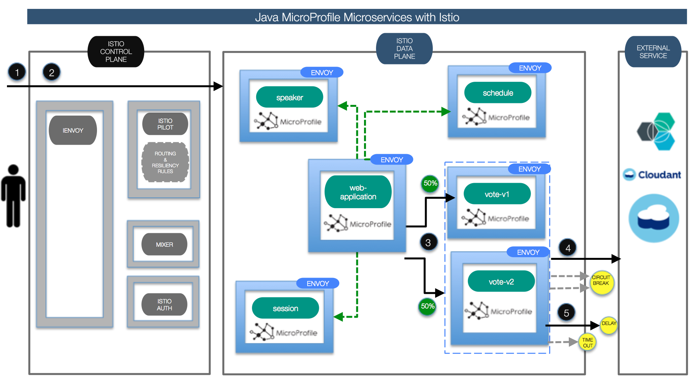
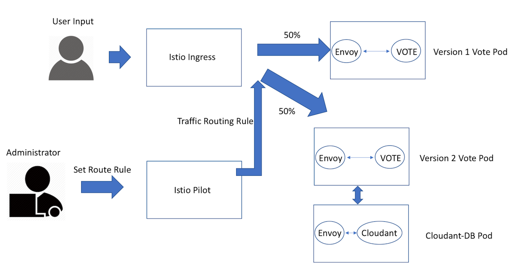
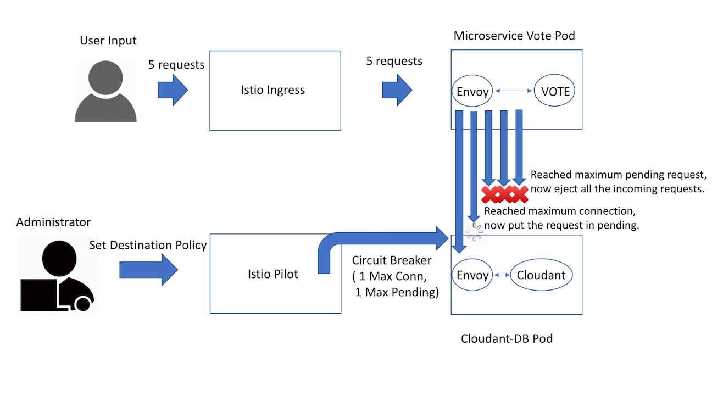
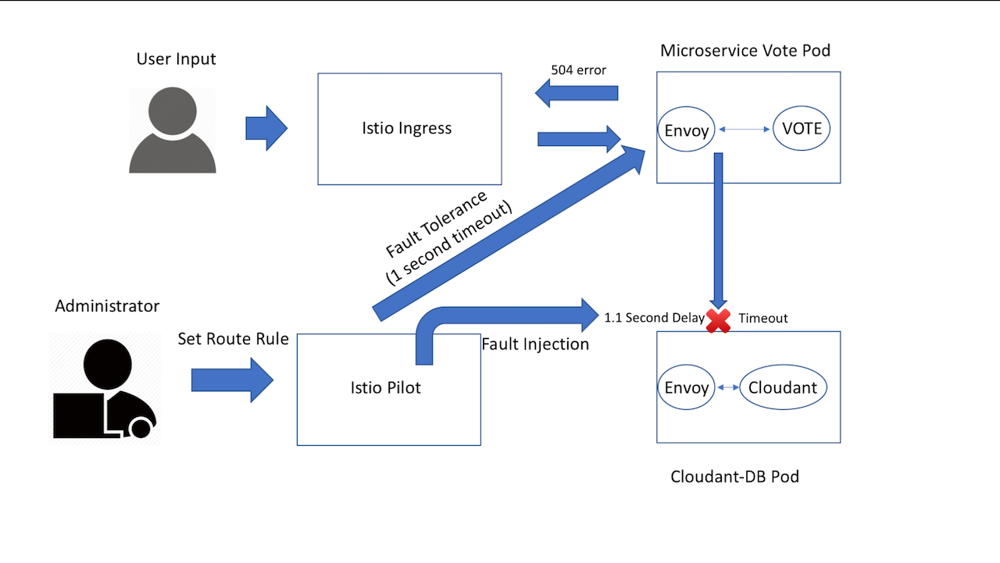

[](https://travis-ci.org/IBM/Java-MicroProfile-Microservices-on-Istio)

# Enable your Java MicroProfile Microservices with advanced resiliency and traffic management features leveraging Istio 


[MicroProfile](http://microprofile.io) is a baseline platform definition that optimizes Enterprise Java for a microservices architecture and delivers application portability across multiple MicroProfile runtimes. It delivers application portability across multiple MicroProfile runtimes; the initial baseline is JAX-RS plus CDI plus JSON-P.

Building and packaging these Java microservice is one part of the story. How do we connect, manage, deploy and scale them? Moving forward, how do we collect metrics about traffic behavior, which can be used to enforce policy decisions such as fine-grained access control and rate limits? Enter service mesh and Istio, which allows us to connect, manage, and secure microservices, and enable deeper insights into the microservices metrics. Istio provides an easy way to create this service mesh by deploying a [control plane](https://istio.io/docs/concepts/what-is-istio/overview.html#architecture) and injecting sidecars, an extended version of the  [Envoy](https://lyft.github.io/envoy/) proxy, in the same Pod as your microservice.

In this code we demonstrate how to build, deploy, connect, manage and monitor Java MicroProfile microservices leveraging Istio service mesh. Once this is done, specific features from Istio we dive in are.  

**Canary deployments**: In most cases, when components are upgraded it’s useful to deploy the new version but only have a small subset of network traffic routed to it so that it can be tested before the old version is removed. This is often referred to as “canary testing”.

**Resiliency and fault tolerance**: Istio adds fault tolerance to your application without any changes to code. Some of resiliency features it supports are: 

 - Retries/Timeouts
 - Circuit breakers
 - Health checks
 - Control connection pool size and request load
 - Systematic fault injection

In this code we will show how to configure and use Circuit Breakers, Fault Inection and Retries/Timeouts resiliency features for your Java Microservices application.



## Included Components
- [MicroProfile](https://microprofile.io)
- [Istio](https://istio.io/)
- [Kubernetes Clusters](https://console.ng.bluemix.net/docs/containers/cs_ov.html#cs_ov)
- [Cloudant](https://www.ibm.com/analytics/us/en/technology/cloud-data-services/cloudant/)
- [Bluemix DevOps Toolchain Service](https://console.ng.bluemix.net/catalog/services/continuous-delivery)

# Prerequisite
- Create a Kubernetes cluster with either [Minikube](https://kubernetes.io/docs/getting-started-guides/minikube) for local testing, or with [IBM Bluemix Container Service](https://github.com/IBM/container-journey-template) to deploy in the cloud. The code here is regularly tested against [Kubernetes Cluster from Bluemix Container Service](https://console.ng.bluemix.net/docs/containers/cs_ov.html#cs_ov) using Travis.
- You will also need Istio service mesh installed on top of your Kubernetes cluster. Please follow the instructions, [Istio getting started](https://github.com/IBM/Istio-getting-started), to get Istio mesh installed on Kubernetes.

# Deploy to Bluemix
If you want to deploy the Java MicroProfile app directly to Bluemix, click on 'Deploy to Bluemix' button below to create a [Bluemix DevOps service toolchain and pipeline](https://console.ng.bluemix.net/docs/services/ContinuousDelivery/toolchains_about.html#toolchains_about) for deploying the sample, else jump to [Steps](#steps)

> You will need to create your Kubernetes cluster first and make sure it is fully deployed in your Bluemix account.

[](https://console.ng.bluemix.net/devops/setup/deploy/)

Please follow the [Toolchain instructions](https://github.com/IBM/container-journey-template/blob/master/Toolchain_Instructions_new.md) to complete your toolchain and pipeline.

# Steps

## Part A: Building microservices and enabling ingress traffic

1. [Get and build the application code](#1-get-and-build-the-application-code)
2. [Deploy application microservices and Istio envoys](#2-deploy-application-microservices-and-istio-envoys)

## Part B: Explore Istio features: Configuring Request Routing, Circuit Breakers, and Fault Injection

3. [Create a content-based routing for your microservices](#3-create-a-content-based-routing-for-your-microservices)
4. [Add resiliency feature - Circuit Breakers](#4-add-resiliency-feature---circuit-breakers)
5. [Add resiliency feature - Timeouts and Retries](#5-add-resiliency-feature---timeouts-and-retries)

#### [Troubleshooting](#troubleshooting-1)


## Part A: Building microservices and enabling ingress traffic
## 1. Get and build the application code

Before you proceed to the following instructions, make sure you have [Maven](https://maven.apache.org/install.html) and [Docker](https://www.docker.com/community-edition#/download) installed on your machine.

First, clone and get in our repository to obtain the necessary yaml files and scripts for downloading and building your applications and microservices.

```shell
git clone https://github.com/IBM/Java-MicroProfile-Microservices-on-Istio.git 
cd Java-MicroProfile-Microservices-on-Istio
```

Then, install the container registry plugin for Bluemix CLI and create a namespace to store your images.

```shell
bx plugin install container-registry -r Bluemix
bx cr namespaces #If there's a namespace in your account, then you don't need to create a new one.
bx cr namespace-add <namespace> #replace <namespace> with any name.
```

> **Note:** For the following steps, you can get the code and build the package by running 
> ```shell
> bash scripts/get_code_linux.sh #For Linux users
> bash scripts/get_code_osx.sh #For Mac users
> ```
>Then, you can move on to [Step 3](#3-inject-istio-envoys-on-java-microprofile-application).

  `git clone` the following projects:
   * [Web-App](https://github.com/WASdev/sample.microservicebuilder.web-app)
   ```shell
      git clone https://github.com/WASdev/sample.microservicebuilder.web-app.git
  ```
   * [Schedule](https://github.com/WASdev/sample.microservicebuilder.schedule)
   ```shell
      git clone https://github.com/WASdev/sample.microservicebuilder.schedule.git
  ```
   * [Speaker](https://github.com/WASdev/sample.microservicebuilder.speaker)
   ```shell
      git clone https://github.com/WASdev/sample.microservicebuilder.speaker.git
  ```
   * [Session](https://github.com/WASdev/sample.microservicebuilder.session)
   ```shell
      git clone https://github.com/WASdev/sample.microservicebuilder.session.git
  ```
   * [Vote Version 1](https://github.com/WASdev/sample.microservicebuilder.vote) 
   ```shell
      git clone https://github.com/WASdev/sample.microservicebuilder.vote.git
      cd sample.microservicebuilder.vote/
      git checkout 4bd11a9bcdc7f445d7596141a034104938e08b22
  ```

* `mvn clean package` in each ../sample.microservicebuilder.* projects

Now, use the following commands to build the microservice containers.

Build the web-app microservice container

```shell
cd sample.microservicebuilder.web-app
docker build -t registry.ng.bluemix.net/<namespace>/microservice-webapp .
docker push registry.ng.bluemix.net/<namespace>/microservice-webapp
```

Build the schedule microservice container

```shell
cd sample.microservicebuilder.schedule
docker build -t registry.ng.bluemix.net/<namespace>/microservice-schedule .
docker push registry.ng.bluemix.net/<namespace>/microservice-schedule
```

Build the speaker microservice container

```shell
cd sample.microservicebuilder.speaker
docker build -t registry.ng.bluemix.net/<namespace>/microservice-speaker .
docker push registry.ng.bluemix.net/<namespace>/microservice-speaker
```

Build the session microservice container

```shell
cd sample.microservicebuilder.session
docker build -t registry.ng.bluemix.net/<namespace>/microservice-session .
docker push registry.ng.bluemix.net/<namespace>/microservice-session
```

Build the vote microservice container

```shell
cd sample.microservicebuilder.vote
docker build -t registry.ng.bluemix.net/<namespace>/microservice-vote .
docker push registry.ng.bluemix.net/<namespace>/microservice-vote
```

> For this example, we will provide you the *version 2 vote image* because it can only be built with Linux environment. If you want to build your own version 2 vote image, please follow [this instruction](ubuntu.md) on how to build it on Docker Ubuntu.

## 2. Deploy application microservices and Istio envoys

Before you proceed to the following steps, change the `<namespace>` in your yaml files to your own namespace.
>Note: If you ran the **get_code** script, your namespace is already changed.

Envoys are deployed as sidecars on each microservice. Injecting Envoy into your microservice means that the Envoy sidecar would manage the ingoing and outgoing calls for the service. To inject an Envoy sidecar to an existing microservice configuration, do:
```shell
kubectl apply -f <(istioctl kube-inject -f manifests/deploy-schedule.yaml)
kubectl apply -f <(istioctl kube-inject -f manifests/deploy-session.yaml)
kubectl apply -f <(istioctl kube-inject -f manifests/deploy-speaker.yaml)
kubectl apply -f <(istioctl kube-inject -f manifests/deploy-cloudant.yaml --includeIPRanges=172.30.0.0/16,172.20.0.0/16)
kubectl apply -f <(istioctl kube-inject -f manifests/deploy-vote.yaml)
kubectl apply -f <(istioctl kube-inject -f manifests/deploy-webapp.yaml)
```

After a few minutes, you should now have your Kubernetes Pods running and have an Envoy sidecar in each of them alongside the microservice. The microservices are **schedule, session, speaker, vote-v1, vote-v2, cloudant, and webapp**. 
```shell
$ kubectl get pods
NAME                                           READY     STATUS      RESTARTS   AGE
cloudant-db-4102896723-6ztmw                   2/2       Running     0          1h
cloudant-secret-generator-deploy-lwmrs         1/2       Completed   0          4h
istio-egress-3946387492-5wtbm                  1/1       Running     0          2d
istio-ingress-4179457893-clzjf                 1/1       Running     0          2d
istio-mixer-2598054512-bm3st                   1/1       Running     0          2d
istio-pilot-2676867826-z63pq                   2/2       Running     0          2d
microservice-schedule-sample-971365647-74648   2/2       Running     0          2d
microservice-session-sample-2341329899-2bjhg   2/2       Running     0          2d
microservice-speaker-sample-1294850951-w76b5   2/2       Running     0          2d
microservice-vote-sample-v1-3410940397-9cm8m   2/2       Running     0          1h
microservice-vote-sample-v2-3728755778-5c4vx   2/2       Running     0          1h
microservice-webapp-sample-3875068375-bvp87    2/2       Running     0          2d   
```

To access your application, you want to create an ingress to connect all the microservices and access it via istio ingress. Thus, we will run

```shell
kubectl create -f manifests/ingress.yaml
```

Since we have 2 version of vote deployment, we need to setup a route rule to avoid version conflict. The following route rule will sent all the traffic to version 1 vote deployment.

```shell
istioctl create -f manifests/route-rule-v1.yaml
```

You can check the public IP address of your cluster through `kubectl get nodes` and get the NodePort of the istio-ingress service for port 80 through `kubectl get svc | grep istio-ingress`. Or you can also run the following command to output the IP address and NodePort:
```bash
echo $(kubectl get pod -l istio=ingress -o jsonpath={.items[0].status.hostIP}):$(kubectl get svc istio-ingress -o jsonpath={.spec.ports[0].nodePort})
#This should output your IP:NodePort e.g. 184.172.247.2:30344
```

Point your browser to:  
`http://<IP:NodePort>` Replace with your own IP and NodePort.

Congratulation, you MicroProfile application is running and it should look like [this](microprofile_ui.md).


## Part B: Explore Istio features: Configuring Request Routing, Circuit Breakers, and Fault Injection

## 3. Create a content-based routing for your microservices

> Note: Currently the route matching rule is not working within Istio ingress network because there's a bug in Istio 0.1.6. For now, we will show you how to use route-rule to split the traffic for each version. Content-based routing is simply adding matching rule for your content on top of your traffic rule.
>
> You can follow this [instruction](content-based-routing.md) to create a content-based routing once you have Istio 0.2.X or built your own [istio pilot](https://github.com/istio/pilot) with the commit that's beyond Jun 30, 2017(Not stable).

Now you have 2 different version of microservice vote sample, let's create a new Istio route rule to split the traffic to each version. First, take a look at the **manifests/route-rule-vote.yaml** file.

```yaml
type: route-rule
name: vote-default
spec:
  destination: vote-service.default.svc.cluster.local
  precedence: 1
  route:
  - tags:
      version: v1
    weight: 50
  - tags:
      version: v2
    weight: 50
```

This route-rule will let each version receive 50% of the traffic. You can change the **weight** to split more traffic on a particular version. Make sure all the weights add up to 100.



Now let's apply this rule to your Istio Pilot.

```shell
istioctl replace -f manifests/route-rule-vote.yaml
istioctl get route-rules -o yaml #You can view all your route-rules by executing this command
```

Now each version of your vote microservice should receive half of the traffic. Let's test it out by accessing your application.

Point your browser to:  
`http://<IP:NodePort>` Replace with your own IP and NodePort.

Now go to the vote section, you should see that half of the time the vote is empty since there's no data initialized in the database. You can start voting at the speaker or session section to see the vote microservice is reflecting your changes. (You browser may cache some of the JavaScript files, so it might take 10 to 20 seconds to start loading the actual changes.)

> Note: Your microservice vote version 2 will use cloudantDB as the database, and it will initialize the database on your first POST request on the app. Therefore, when you vote on the speaker/session for your first time, please only vote once within the first 10 seconds to avoid causing a race condition on creating the new databases.

## 4. Add resiliency feature - Circuit Breakers

Circuit breaking is a critical component of distributed systems. It’s nearly always better to fail quickly and apply back pressure downstream as soon as possible. Envoy enforces circuit breaking limits at the network level as opposed to having to configure and code each application independently. 

Now we will show you how to enable circuit breaker for the sample Java microservice application when your Database is broken. 

In order to test this example, we want all our traffic routed to v2. Therefore, apply this route rule.

```shell
istioctl replace -f manifests/route-rule-v2.yaml
```

Before we move on, we need to understand these different types of Circuit Breaker:
- Maximum Connections: Maximum number of connections to a backend. Any excess connection will be pending in a queue. You can modify this number by changing the `maxConnections` field.
- Maximum Pending Requests: Maximum number of pending requests to a backend. Any excess pending requests will be denied. You can modify this number by changing the `httpMaxPendingRequests` field.

Now take a look at the **circuit-breaker-db.yaml** file in manifests. We set Cloudant's maximum connections to 1 and Maximum pending requests to 1. Thus, if we sent more than 2 requests at once to cloudant, cloudant will have 1 pending request and deny any additional requests until the pending request is processed. Furthermore, it will detect any host that trigger a server error (5XX code) in the Cloudant's Envoy and eject all their requests for 15 minutes. You can visit [here](https://istio.io/docs/reference/config/traffic-rules/destination-policies.html#simplecircuitbreakerpolicy) to check out more details for each field. 

```yaml
type: destination-policy
name: db-circuit
spec:
  destination: cloudant-service.default.svc.cluster.local
  policy:
    - circuitBreaker:
        simpleCb:
          maxConnections: 1
          httpMaxPendingRequests: 1
          httpConsecutiveErrors: 1     
          sleepWindow: 15m             #required field
          httpDetectionInterval: 1s    #required field   
          httpMaxEjectionPercent: 100  
```




Create a circuit breaker policy on your cloudant service.

```shell
istioctl create -f manifests/circuit-breaker-db.yaml
```

Now point your browser to:  `http://<IP:NodePort>`, enable your **developer mode** on your browser, and click on **network**. Go to Speaker or Session and try to vote 5 times within a second. Then, you should see the last 2 to 3 vote will return a server error because there are more than one pending request get sent to cloudant. Therefore, the circuit breaker will eject the rest of the requests.

> Note: using fault injection or mixer rule won't able to trigger the circuit breaker because all the traffic will be aborted/delayed before it get sent to the cloudant's Envoy.

## 5. Add resiliency feature - Timeouts and Retries

Here's an example to demonstrate how can you add resiliency via timeouts in your application. First, we want to create a 1-second timeout to the vote service, so the vote service can stop listening if cloudant is not responding within 1-second. 

Then, in order to make sure we can trigger and test this, we will inject more than 1-second delay to cloudant, so the vote service will be timeout for each response from cloudant. This process is called Fault Injection, where essentially we are introducing fault injetion.



Now take a look at the **timeout-vote** file in manifests.
```yaml
type: route-rule
name: timeout
spec:
  destination: vote-service.default.svc.cluster.local
  httpReqTimeout:
    simpleTimeout:
      timeout: 1s
  # httpReqRetries:
  # simpleRetry:
  #   attempts: 3
  #   perTryTimeout: 1s
```

This rule will timeout all the responses that take more than 1 second in the vote service. You can modify `timeout` to add more time for your timeout. You also can apply retries rule by uncommenting the `httpReqRetries` section and delete/commenting out the `httpReqTimeout` section. Now, let's apply a 1-second timeout on your Vote service.

```shell
istioctl create -f manifests/timeout-vote.yaml
```

In order to test our timeout rule is working properly, we need to apply some fault injections. Thus, take a look at the **fault-injection.yaml** in manifests. 
```yaml
type: route-rule
name: cloudant-delay
spec:
  destination: cloudant-service.default.svc.cluster.local
  precedence: 2
  httpFault:
    delay:
      percent: 100
      fixedDelay: 1.1s
    # abort:
    #   percent: 10
    #   httpStatus: 503
```

This rule will inject a fixed 1.1-second delay on all the requests going to Cloudant. You can modify `percent` and `fixedDelay` to change the probability and the amount of time for delay. Furthermore, you can uncomment the abort section to inject some abort errors. Now let's apply a 1.1-second delay on the cloudant service to trigger your Vote service timeout.

```shell
istioctl create -f manifests/fault-injection.yaml
```

Now point your browser to:  `http://<IP:NodePort>` 

Next, enable your **developer mode** on your browser and click on **network**. Then, click **Vote** on the microprofile site. Now you should able to see a 504 timeout error for the GET request on `http://<IP:NodePort>/vote/rate` since cloudant needs more than one second to response back to the vote service.

# Troubleshooting
* To delete Istio from your cluster, run the following commands in your istio directory
```shell
kubectl delete -f install/kubernetes/istio-rbac-alpha.yaml # or istio-rbac-beta.yaml
kubectl delete -f install/kubernetes/istio.yaml
```
* To delete your microprofile application, run the following commands in this Github repo's main directory
```shell
kubectl delete -f manifests
```

# References
[Istio.io](https://istio.io/docs/tasks/index.html)

This Java MicroProfile codebase is based on WebSphere Liberty's [Microprofile Showcase Application](https://github.com/WASdev/sample.microservicebuilder.docs)

# License
[Apache 2.0](http://www.apache.org/licenses/LICENSE-2.0)

