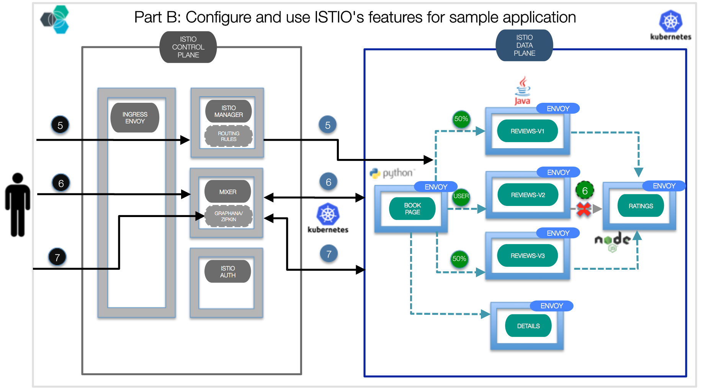
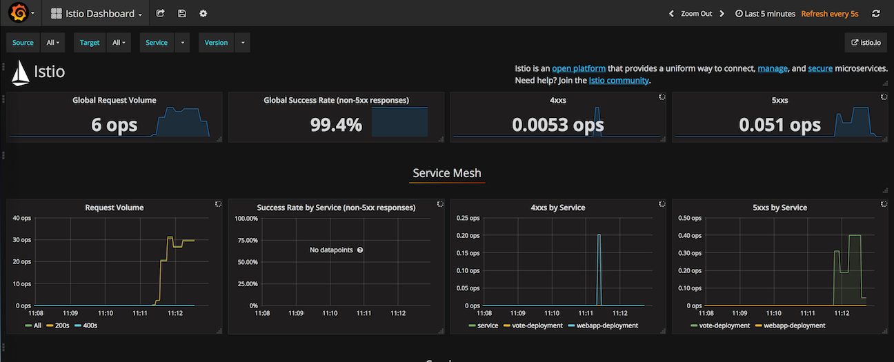
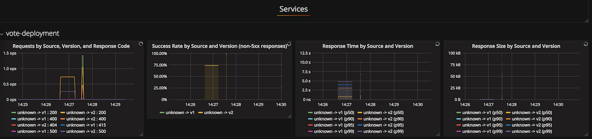
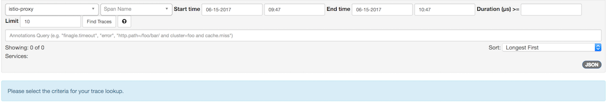

[](https://travis-ci.org/IBM/Java-MicroProfile-Microservices-on-Istio)

# Java MicroProfile Microservices on Istio


[MicroProfile](http://microprofile.io) is a baseline platform definition that optimizes Enterprise Java for a microservices architecture and delivers application portability across multiple MicroProfile runtimes.

Building and packaging these Java microservice is one part of the story. How do we connect, manage, deploy and scale them? Moving forward, how do we collect metrics about about traffic behavior, which can be used to enforce policy decisions such as fine-grained access control and rate limits? Enter service mesh. A service mesh, necessity for today's cloud-native applications, is a layer for making microservices inter communication secure, fast, reliable, and enable deeper insights into the microservices metrics. 

[Istio](http://istio.io) is an open platform that provides a uniform way to connect, manage, and secure microservices. Istio is the result of a joint collaboration between IBM, Google and Lyft as a means to support traffic flow management, access policy enforcement and the telemetry data aggregation between microservices, all without requiring changes to the code of your microservice. Istio provides an easy way to create this service mesh by deploying a [control plane](https://istio.io/docs/concepts/what-is-istio/overview.html#architecture) and injecting sidecars, an extended version of the  [Envoy](https://lyft.github.io/envoy/) proxy, in the same Pod as your microservice.

In this code we demonstrate how to deploy, connect, manage and monitor Java microservices leveraging MicroProfile on Istio service mesh.



## Included Components
- [Istio](https://istio.io/)
- [Kubernetes Clusters](https://console.ng.bluemix.net/docs/containers/cs_ov.html#cs_ov)
- [Grafana](http://docs.grafana.org/guides/getting_started)
- [Zipkin](http://zipkin.io/)
- [Prometheus](https://prometheus.io/)
- [Bluemix container service](https://console.ng.bluemix.net/catalog/?taxonomyNavigation=apps&category=containers)
- [Bluemix DevOps Toolchain Service](https://console.ng.bluemix.net/catalog/services/continuous-delivery)

# Prerequisite
Create a Kubernetes cluster with either [Minikube](https://kubernetes.io/docs/getting-started-guides/minikube) for local testing, or with [IBM Bluemix Container Service](https://github.com/IBM/container-journey-template) to deploy in cloud. The code here is regularly tested against [Kubernetes Cluster from Bluemix Container Service](https://console.ng.bluemix.net/docs/containers/cs_ov.html#cs_ov) using Travis.

# Deploy to Bluemix
If you want to deploy the Java MicroProfile app directly to Bluemix, click on 'Deploy to Bluemix' button below to create a [Bluemix DevOps service toolchain and pipeline](https://console.ng.bluemix.net/docs/services/ContinuousDelivery/toolchains_about.html#toolchains_about) for deploying the sample, else jump to [Steps](#steps)

> You will need to create your Kubernetes cluster first and make sure it is fully deployed in your Bluemix account.

[](https://console.ng.bluemix.net/devops/setup/deploy/)

Please follow the [Toolchain instructions](https://github.com/IBM/container-journey-template/blob/master/Toolchain_Instructions_new.md) to complete your toolchain and pipeline.

# Steps

1. [Installing Istio](#1-installing-istio-in-your-cluster)
2. [Get and build the application code](#2-get-and-build-the-application-code)
3. [Inject Istio on Java MicroProfile App](#3-inject-istio-envoys-on-java-microprofile-application)
4. [Access your Application](#4-access-your-application)
5. [Collecting Metrics and Logs](#5-collecting-metrics-and-logs)
6. [Request Tracing](#6-request-tracing)

#### [Troubleshooting](#troubleshooting-1)

# 1. Installing Istio in your Cluster
## 1.1 Download the Istio source
  1. Download the latest Istio release for your OS: [Istio releases](https://github.com/istio/istio/releases)  
  2. Extract and go to the root directory.
  3. Copy the `istioctl` bin to your local bin  
  ```bash
  $ cp bin/istioctl /usr/local/bin
  ## example for macOS
  ```

## 1.2 Grant Permissions  
  1. Run the following command to check if your cluster has RBAC  
  ```bash
  $ kubectl api-versions | grep rbac
  ```  
  2. Grant permissions based on the version of your RBAC  
    * If you have an **alpha** version, run:

      ```bash
      $ kubectl apply -f install/kubernetes/istio-rbac-alpha.yaml
      ```

    * If you have a **beta** version, run:

      ```bash
      $ kubectl apply -f install/kubernetes/istio-rbac-beta.yaml
      ```

    * If **your cluster has no RBAC** enabled, proceed to installing the **Control Plane**.

## 1.3 Install the [Istio Control Plane](https://istio.io/docs/concepts/what-is-istio/overview.html#architecture) in your cluster  
```bash
kubectl apply -f install/kubernetes/istio.yaml
```
You should now have the Istio Control Plane running in Pods of your Cluster.
```bash
$ kubectl get pods
NAME                              READY     STATUS    RESTARTS
istio-egress-3850639395-30d1v     1/1       Running   0       
istio-ingress-4068702052-2st6r    1/1       Running   0       
istio-manager-251184572-x9dd4     2/2       Running   0       
istio-mixer-2499357295-kn4vq      1/1       Running   0       
```
* _(Optional) For more options/addons such as installing Istio with [Auth feature](https://istio.io/docs/concepts/network-and-auth/auth.html) and [collecting telemetry data](https://istio.io/docs/tasks/metrics-logs.html), go [here](https://istio.io/docs/tasks/installing-istio.html#prerequisites)._

# 2. Get and build the application code

Before you proceed to the following instructions, make sure you have [Maven](https://maven.apache.org/install.html) installed on your machine.

First, clone and get in our repository `git clone https://github.com/IBM/Java-MicroProfile-Microservices-on-ISTIO.git && cd Java-MicroProfile-Microservices-on-ISTIO` to obtain the necessary yaml files and scripts for downloading and building your applications and microservices.

Then, install the container registry plugin for Bluemix CLI and create a namespace to store your images.

```bash
bx plugin install container-registry -r Bluemix
bx cr namespaces #If there's a namespace in your account, then you don't need to create a new one.
bx cr namespace-add <namespace> #replace <namespace> with any name.
```

> **Note:** For the following steps, you can get the code and build the package by running 
> ```bash
> bash scripts/get_code_linux.sh #For Linux users
> bash scripts/get_code_osx.sh #For Mac users
> ```
>Then, you can move on to [Step 3](#3-inject-istio-envoys-on-java-microprofile-application).

  `git clone` the following projects:
   * [Web-App](https://github.com/WASdev/sample.microservicebuilder.web-app)
   ```bash
      git clone https://github.com/WASdev/sample.microservicebuilder.web-app.git
  ```
   * [Schedule](https://github.com/WASdev/sample.microservicebuilder.schedule)
   ```bash
      git clone https://github.com/WASdev/sample.microservicebuilder.schedule.git
  ```
   * [Speaker](https://github.com/WASdev/sample.microservicebuilder.speaker)
   ```bash
      git clone https://github.com/WASdev/sample.microservicebuilder.speaker.git
  ```
   * [Session](https://github.com/WASdev/sample.microservicebuilder.session)
   ```bash
      git clone https://github.com/WASdev/sample.microservicebuilder.session.git
  ```
   * [Vote](https://github.com/WASdev/sample.microservicebuilder.vote)
   ```bash
      git clone https://github.com/WASdev/sample.microservicebuilder.vote.git
      cd sample.microservicebuilder.vote/
      git checkout 4bd11a9bcdc7f445d7596141a034104938e08b22
  ```

* `mvn clean package` in each ../sample.microservicebuilder.* projects

Now, use the following commands to build the microservers containers.

Build the web-app microservice container

```bash
cd sample.microservicebuilder.web-app
docker build -t registry.ng.bluemix.net/<namespace>/microservice-webapp .
docker push registry.ng.bluemix.net/<namespace>/microservice-webapp
```

Build the vote microservice container

```bash
cd sample.microservicebuilder.vote
docker build -t registry.ng.bluemix.net/<namespace>/microservice-vote .
docker push registry.ng.bluemix.net/<namespace>/microservice-vote
```

Build the schedule microservice container

```bash
cd sample.microservicebuilder.schedule
docker build -t registry.ng.bluemix.net/<namespace>/microservice-schedule .
docker push registry.ng.bluemix.net/<namespace>/microservice-schedule
```

Build the speaker microservice container

```bash
cd sample.microservicebuilder.speaker
docker build -t registry.ng.bluemix.net/<namespace>/microservice-speaker .
docker push registry.ng.bluemix.net/<namespace>/microservice-speaker
```

Build the session microservice container

```bash
cd sample.microservicebuilder.session
docker build -t registry.ng.bluemix.net/<namespace>/microservice-session .
docker push registry.ng.bluemix.net/<namespace>/microservice-session
```

# 3. Inject Istio Envoys on Java MicroProfile Application

Before you proceed to the following steps, change the `<namespace>` in your yaml files to your own namespace.
>Note: If you ran the **get_code** script, your namespace is already changed.

Envoys are deployed as sidecars on each microservice. Injecting Envoy into your microservice means that the Envoy sidecar would manage the ingoing and outgoing calls for the service. To inject an Envoy sidecar to an existing microservice configuration, do:
```bash
kubectl apply -f <(istioctl kube-inject -f manifests/deploy-schedule.yaml --includeIPRanges=172.30.0.0/16,172.20.0.0/16)
kubectl apply -f <(istioctl kube-inject -f manifests/deploy-session.yaml --includeIPRanges=172.30.0.0/16,172.20.0.0/16)
kubectl apply -f <(istioctl kube-inject -f manifests/deploy-speaker.yaml --includeIPRanges=172.30.0.0/16,172.20.0.0/16)
kubectl apply -f <(istioctl kube-inject -f manifests/deploy-vote.yaml --includeIPRanges=172.30.0.0/16,172.20.0.0/16)
kubectl apply -f <(istioctl kube-inject -f manifests/deploy-webapp.yaml --includeIPRanges=172.30.0.0/16,172.20.0.0/16)
```

After a few minutes, you should now have your Kubernetes Pods running and have an Envoy sidecar in each of them alongside the microservice. The microservices are **schedule, session, speaker, vote, and webapp**. 
```
$ kubectl get pods
NAME                                            READY     STATUS    RESTARTS
istio-egress-3850639395-30d1v                   1/1       Running   0       
istio-ingress-4068702052-2st6r                  1/1       Running   0       
istio-pilot-251184572-x9dd4                     2/2       Running   0       
istio-mixer-2499357295-kn4vq                    1/1       Running   0       
microservice-schedule-sample-1128108920-bmfzp   2/2       Running   0          
microservice-session-sample-1072599709-3bx9d    2/2       Running   0          
microservice-speaker-sample-1948947026-f22n3    2/2       Running   0          
microservice-vote-sample-3285487307-v8518       2/2       Running   0          
microservice-webapp-sample-3174273294-4b877     2/2       Running   0     
```
# 4. Access your Application

we want to create an ingress to connect all the microservices and access it via istio ingress. Thus, we will run

```bash
kubectl create -f manifests/ingress.yaml
```

To access your application, you can check the public IP address of your cluster through `kubectl get nodes` and get the NodePort of the istio-ingress service for port 80 through `kubectl get svc | grep istio-ingress`. Or you can also run the following command to output the IP address and NodePort:
```bash
$ echo $(kubectl get po -l istio=ingress -o jsonpath={.items[0].status.hostIP}):$(kubectl get svc istio-ingress -o jsonpath={.spec.ports[0].nodePort})
IP:NodePort #e.g. 184.172.247.2:30344
```

Point your browser to:  
`http://<IP:NodePort>` Replace with your own IP and NodePort.

Congratulation, you MicroProfile application is running and it should look like [this](microprofile_ui.md).

# 5. Collecting Metrics and Logs
This step shows you how to configure [Istio Mixer](https://istio.io/docs/concepts/policy-and-control/mixer.html) to gather telemetry for services in your cluster.
* First, go back to your Isito's main directory. Install the required Istio Addons on your cluster: [Prometheus](https://prometheus.io) and [Grafana](https://grafana.com)
  ```bash
  kubectl apply -f install/kubernetes/addons/prometheus.yaml
  kubectl apply -f install/kubernetes/addons/grafana.yaml
  ```
* Verify that your **Grafana** dashboard is ready. Get the IP of your cluster `kubectl get nodes` and then the NodePort of your Grafana service `kubectl get svc | grep grafana` or you can run the following command to output both:
  ```bash
  $ echo $(kubectl get po -l app=grafana -o jsonpath={.items[0].status.hostIP}):$(kubectl get svc grafana -o jsonpath={.spec.ports[0].nodePort})
  184.xxx.yyy.zzz:30XYZ
  ```
  Point your browser to `184.xxx.yyy.zzz:30XYZ/dashboard/db/istio-dashboard` to go directly to your dashboard.  
  Your dashboard should look like this:  
  

* To collect new telemetry data, you will use `istio mixer rule create`. For this sample, you will generate logs for Response Size for vote service.
  ```bash
  $ istioctl mixer rule get vote-deployment.default.svc.cluster.local vote-deployment.default.svc.cluster.local
  Error: the server could not find the requested resource
  ```
* Create a configuration YAML file and name it as `new_rule.yaml`:
  ```yaml
  revision: "1"
  rules:
  - aspects:
    - adapter: prometheus
      kind: metrics
      params:
        metrics:
        - descriptor_name: response_size
          value: response.size | 0
          labels:
            source: source.labels["app"] | "unknown"
            target: target.service | "unknown"
            service: target.labels["app"] | "unknown"
            method: request.path | "unknown"
            response_code: response.code | 200
    - adapter: default
      kind: access-logs
      params:
        logName: combined_log
        log:
          descriptor_name: accesslog.combined
          template_expressions:
            originIp: origin.ip
            sourceUser: origin.user
            timestamp: request.time
            method: request.method
            url: request.path
            protocol: request.scheme
            responseCode: response.code
            responseSize: response.size
            referer: request.referer
            userAgent: request.headers["user-agent"]
          labels:
            originIp: origin.ip
            sourceUser: origin.user
            timestamp: request.time
            method: request.method
            url: request.path
            protocol: request.scheme
            responseCode: response.code
            responseSize: response.size
            referer: request.referer
            userAgent: request.headers["user-agent"]
  ```
* Create the configuration on Istio Mixer.
  ```bash
  istioctl mixer rule create vote-deployment.default.svc.cluster.local vote-deployment.default.svc.cluster.local -f new_rule.yaml
  ```
* Send traffic to that service by refreshing your browser to `http://184.xxx.yyy.zzz:30XYZ/productpage` multiple times. You can also do `curl` on your terminal to that URL in a while loop.

* Verify that the new metric is being collected by going to your Grafana dashboard again. The graph on the rightmost should now be populated.


* Verify that the logs stream has been created and is being populated for requests
  ```bash
  $ kubectl logs $(kubectl get pods -l istio=mixer -o jsonpath='{.items[0].metadata.name}') | grep \"combined_log\"
  {"logName":"combined_log","labels":{"referer":"","responseSize":871,"timestamp":"2017-04-29T02:11:54.989466058Z","url":"/reviews","userAgent":"python-requests/2.11.1"},"textPayload":"- - - [29/Apr/2017:02:11:54 +0000] \"- /reviews -\" - 871 - python-requests/2.11.1"}
  ...
  ...
  ...
  ```

[Collecting Metrics and Logs on Istio](https://istio.io/docs/tasks/metrics-logs.html)
# 6. Request Tracing
This step shows you how to collect trace spans using [Zipkin](http://zipkin.io).
* Install the required Istio Addon: [Zipkin](http://zipkin.io)
  ```bash
  $ kubectl apply -f install/kubernetes/addons/zipkin.yaml
  ```
* Access your **Zipkin Dashboard**. Get the IP of your cluster `kubectl get nodes` and then the NodePort of your Zipkin service `kubectl get svc | grep zipkin` or you can run the following command to output both:
  ```bash
  $ echo $(kubectl get po -l app=zipkin -o jsonpath={.items[0].status.hostIP}):$(kubectl get svc zipkin -o jsonpath={.spec.ports[0].nodePort})
  184.xxx.yyy.zzz:30XYZ
  ```  
  Your dashboard should like this:
  

* Send traffic to that service by refreshing your browser to `http://184.xxx.yyy.zzz:30XYZ/productpage` multiple times. You can also do `curl` on your terminal to that URL in a while loop.

* Go to your Zipkin Dashboard again and you will see a number of traces done.

* Click on one those traces and you will see the details of the traffic you sent to your BookInfo App. It shows how much time it took for the request on `productpage`. It also shows how much time ot took for the requests on the `details`,`reviews`, and `ratings` services.


[Zipkin Tracing on Istio](https://istio.io/docs/tasks/zipkin-tracing.html)

# Troubleshooting
* To delete Istio from your cluster
```bash
$ kubectl delete -f install/kubernetes/istio-rbac-alpha.yaml # or istio-rbac-beta.yaml
$ kubectl delete -f install/kubernetes/istio.yaml
```

# References
[Istio.io](https://istio.io/docs/tasks/index.html)

# License
[Apache 2.0](http://www.apache.org/licenses/LICENSE-2.0)

