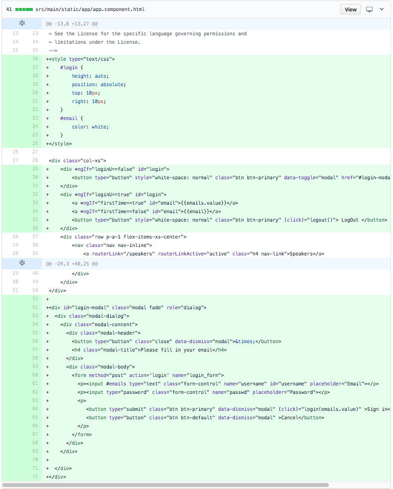
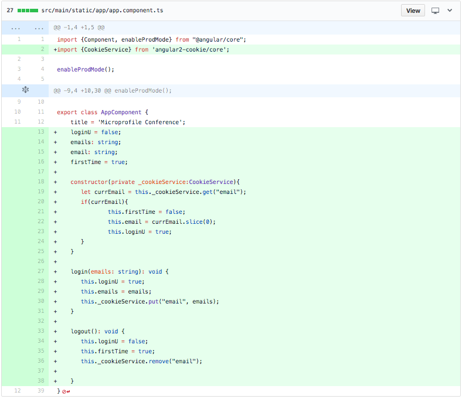
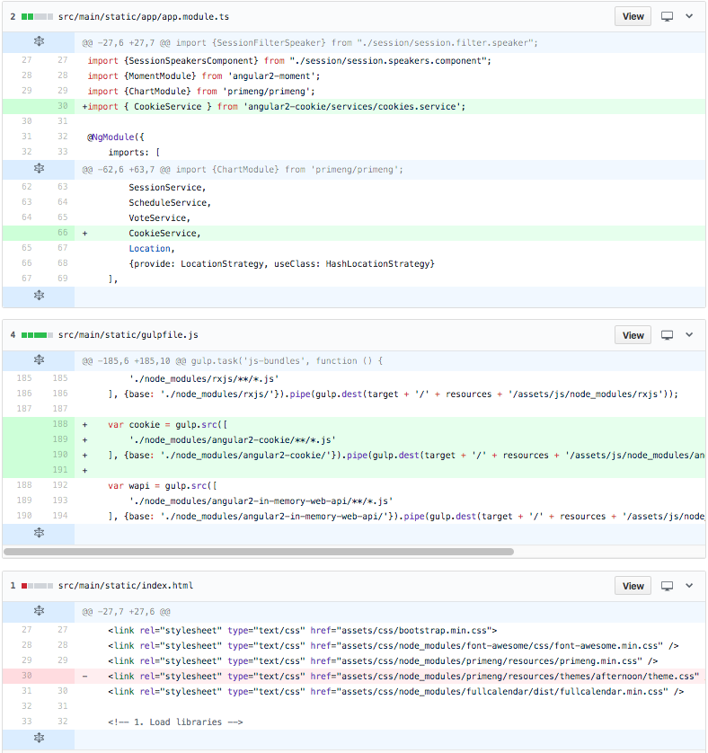
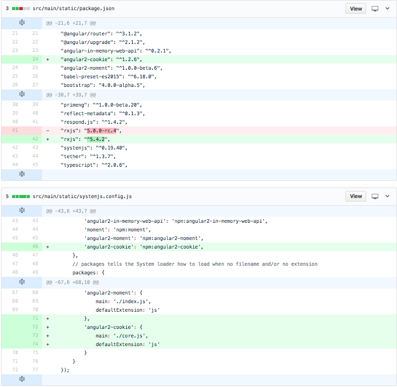

# Preview of added source code for our custom microservice webapp.

For the custom version of the webapp, we added the following code to enable a simple login button to add cookies to the browser.

### HTML code for Login button and UI.

### TyptScript code for adding/removing the cookies on the browser.

### Build dependencies for the cookie library

